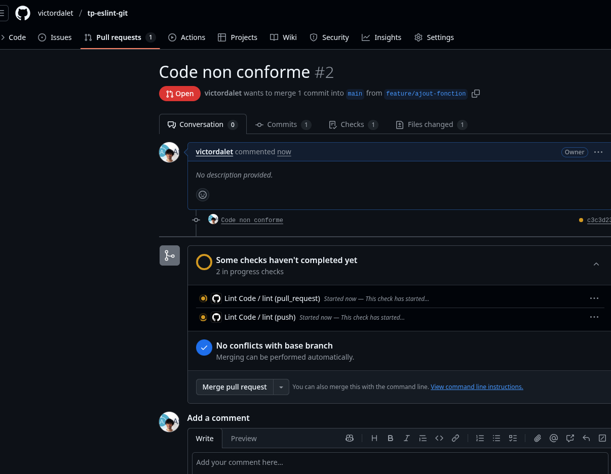

# tp-eslint-git

---

## I - Test de ESLINT

---

```bash
npx eslint app.js
```


- On remarque que Eslite nous prévient bien de l'erreur

## II - Test de husky

---

```bash
git commit -m "Test du hook ESLint"
```


- On remarque que husky marche bien
- J'ai modifié le fichier `.huky/pre-commit` pour mettre la bonne commande

### III - modification des configurations en js

- On modifie le `eslint.config.js` pour mettre les configurations du TP 


- Une fois la conf modifiée, les nouvelles règles sont visibles même sur l'IDE

### IV - Test de github action

---



- Au début l'action se lance et charge


- Puis l'action échoue


- J'ai corrigé le problème afin de pouvoir merge la branch pour ajouter le README a la fin
- Mais du coup j'ai corrigé le problème, et l'action est passée :)

